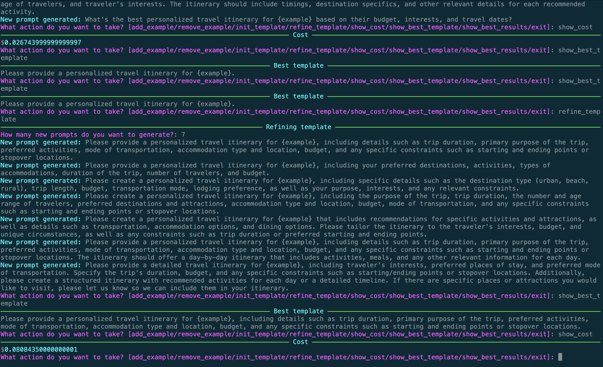

# AutoPrompt

This is a simple tool to help you **automatically find the best prompt for ChatGPT to do a task.** You specify a prompt template, some examples to evaluate the prompt template on, and the tool will iteratively refine the prompt template to perform better on the examples.

## Installation

You will need Python 3.10 or later. Clone this repository and install the requirements:

```bash
$ pip install -r requirements.txt
```

Make sure your OpenAI API key is set in the environment variable `OPENAI_API_KEY`.

## Usage

To get started, run the following command:

```bash
$ python main.py
```

You will be asked what action you want to take:

```bash
$ python main.py
What action do you want to take? [add_example/remove_example/init_template/refine_template/show_cost/show_best_template/show_best_results/exit]:
```

You should start by adding some examples and initializing the template. For example, if you want to generate a prompt for the LLM to suggest a travel itinerary, you might start with the following examples:

```bash
$python main.py
What action do you want to take? [add_example/remove_example/init_template/refine_template/show_cost/show_best_template/show_best_results/exit]: add_example
Enter an example to add, or enter to skip: Japan
What action do you want to take? [add_example/remove_example/init_template/refine_template/show_cost/show_best_template/show_best_results/exit]: add_example
Enter an example to add, or enter to skip: Bay Area
What action do you want to take? [add_example/remove_example/init_template/refine_template/show_cost/show_best_template/show_best_results/exit]: add_example
Enter an example to add, or enter to skip: Salt Lake City
What action do you want to take? [add_example/remove_example/init_template/refine_template/show_cost/show_best_template/show_best_results/exit]: add_example
Enter an example to add, or enter to skip: London
What action do you want to take? [add_example/remove_example/init_template/refine_template/show_cost/show_best_template/show_best_results/exit]: add_example
Enter an example to add, or enter to skip: the beach
```

Then, you can initialize the template, "give me a travel itinerary for {example}":

```bash
$ python main.py
...
What action do you want to take? [add_example/remove_example/init_template/refine_template/show_cost/show_best_template/show_best_results/exit]: init_template
Enter your starting prompt. Include the placeholder text {example} where you want the example to appear: give me a travel itinerary for {example}
```

Now, you can ask the tool to refine the template:

```bash
$ python main.py
...
What action do you want to take? [add_example/remove_example/init_template/refine_template/show_cost/show_best_template/show_best_results/exit]: refine_template
──────────────────────────────────────────────────────────────────── Refining template ─────────────────────────────────────────────────────────────────────
How many new prompts do you want to generate?: 8
New prompt generated: What's the perfect travel itinerary for {example}?
New prompt generated: Suggest an itinerary for {example} to explore.
New prompt generated: "Help me plan an unforgettable trip to {example} by creating an itinerary that includes the best places to visit, must-try foods, and
activities that suit my interests."
New prompt generated: "Suggest a detailed travel itinerary for {example} that includes the best places to visit, things to do, and food to try based on the
traveler's interests and budget."
New prompt generated: Please provide a personalized travel itinerary for {example}.
New prompt generated: Please design a comprehensive travel itinerary for {example}, including popular tourist attractions, accommodations, transportation,
food and beverage recommendations, and any cultural or special events happening during the trip.
New prompt generated: Please provide a personalized travel itinerary for {example} based on specific trip details such as length of stay, budget, number and
age of travelers, and traveler's interests. The itinerary should include timings, destination specifics, and other relevant details for each recommended
activity.
New prompt generated: What's the best personalized travel itinerary for {example} based on their budget, interests, and travel dates?
```

At any point, you can ask the tool to show you your cost incurred so far:

```bash
$ python main.py
...
What action do you want to take? [add_example/remove_example/init_template/refine_template/show_cost/show_best_template/show_best_results/exit]: show_cost
─────────────────────────────────────────────────────────────────────────── Cost ───────────────────────────────────────────────────────────────────────────
$0.026743999999999997
```

Or you can see what the LLM thinks is the best template so far:

```bash
$ python main.py
...
What action do you want to take? [add_example/remove_example/init_template/refine_template/show_cost/show_best_template/show_best_results/exit]: show_best_template
────────────────────────────────────────────────────────────────────── Best template ───────────────────────────────────────────────────────────────────────
Please provide a personalized travel itinerary for {example}.
```

Refining for a few more iterations gives us some pretty good prompt templates:



## How it works

This is an example application of [Motion](https://dm4ml.github.io/motion/), an MLOps framework for continually updating models and prompts in response to new dataflow and data drift.

In the Motion component (src/component.py), we essentially maintain 3 LLM connections:

1. Prompt engineer, which iteratively suggests a new prompt template that would improve on the current prompt template (gpt-3.5-turbo)
2. Answer model, which generates an answer to a prompt for a specific example (text-babbage to reduce cost)
3. Evaluator model, which takes take two answers and determines which one is better (gpt-3.5-turbo)

The results from the answer model might not be very good, but once you find a good template, you can run the template on better models to get better answers. The answer model is only used for comparing prompt templates.

Motion is used to maintain the best prompt and results seen so far in the background while continually refining the prompt template. The best prompt (i.e., pairwise comparisons by the evaluator model) is computed every 5 iterations.

## Visualizing the dataflow

You can upload the latest json file in this repo to [the Motion component vis tool](https://dm4ml.github.io/motion-vis/) to visualize the dataflow.

You can generate the json file yourself by running this command in the `autoprompt` directory:

```bash
$ motion vis src:PromptEngineer
✅ Graph dumped to 2023-05-12-12-33-42_PromptEngineer_graph.json.
```

## Running the webapp

```bash
npm run watch --prefix autoprompt-ui & uvicorn webapp:app --reload && fg
```
