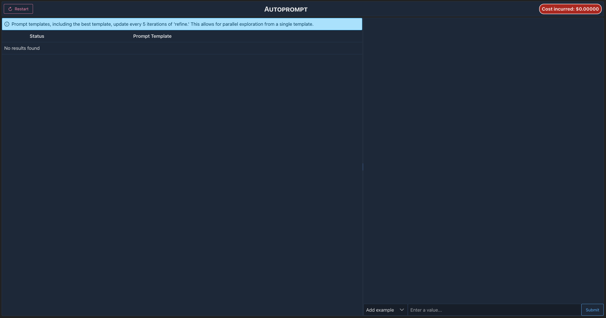
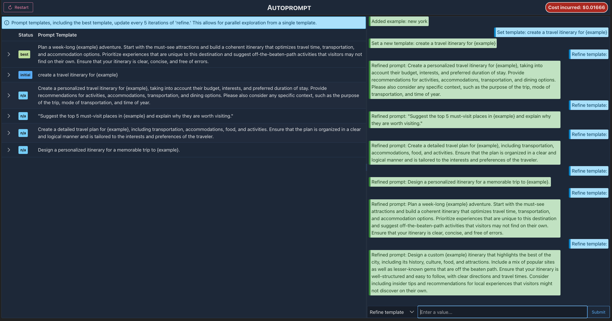

# AutoPrompt

This is a simple tool to help you **automatically find the best prompt for ChatGPT to perform a task.** You specify a prompt template, some examples to evaluate the prompt template on, and the tool will iteratively refine the prompt template to perform better on the examples.

I built this tool to automate better prompt engineering for myself, with my student budget (I don't want to spend more than $0.50 to find a good prompt). It is built on top of [Motion](https://dm4ml.github.io/motion/), an MLOps framework for continually updating models and prompts in response to new dataflow and data drift.

## Installation

You will need Python 3.10 or later and node installed. Clone this repository and install the requirements:

```bash
$ make install
```

You can run the install commands yourself if you do not use pip or npm as your package managers.

Make sure your OpenAI API key is set in the environment variable `OPENAI_API_KEY`.

## Usage

Run the following command to serve the app:

```bash
$ make serve
```



You can interact with the tool in the chat interface in the right pane. First, you should add some examples. Suppose you want to generate a prompt for the LLM to suggest a travel itinerary. You might start with the following examples:

- London
- Paris
- New York

Then, you can initialize the template, "create a travel itinerary for {example}", by choosing the "Set template" option in the right pane.

Now, you can ask the tool to refine the template. You do not need to refine with any input. Refining for a few more iterations gives us some pretty good prompt templates:



Note that the best prompt template is only computed every 5 iterations of the "refine" step. In every iteration of refine, we are improving on the best prompt template computed, so we can explore multiple improvement ideas. Think of this like fine-tuning: we are fine-tuning the prompt template to perform better on the examples, on a batch size of 5.

## How it works

This is an example application of [Motion](https://dm4ml.github.io/motion/), an MLOps framework for continually updating models and prompts in response to new dataflow and data drift.

In the Motion component (src/component.py), we essentially maintain 3 LLM connections:

1. Prompt engineer, which iteratively suggests a new prompt template that would improve on the current prompt template (gpt-3.5-turbo)
2. Answer model, which generates an answer to a prompt for a specific example (text-babbage to reduce cost)
3. Evaluator model, which takes take two answers and determines which one is better (gpt-3.5-turbo)

The results from the answer model might not be very good, but once you find a good template, you can run the template on better models to get better answers. The answer model is only used for comparing prompt templates.

Motion is used to maintain the best prompt template and results seen so far in the background while continually refining the prompt template. The best prompt template (i.e., pairwise comparisons by the evaluator model) is computed every 5 iterations.

## Visualizing the dataflow

You can upload the latest json file in this repo to [the Motion component vis tool](https://dm4ml.github.io/motion-vis/) to visualize the dataflow.

You can generate the json file yourself by running this command in the `autoprompt` directory:

```bash
$ motion vis src:PromptEngineer
✅ Graph dumped to 2023-05-15-12-29-59_PromptEngineer_graph.json
```
